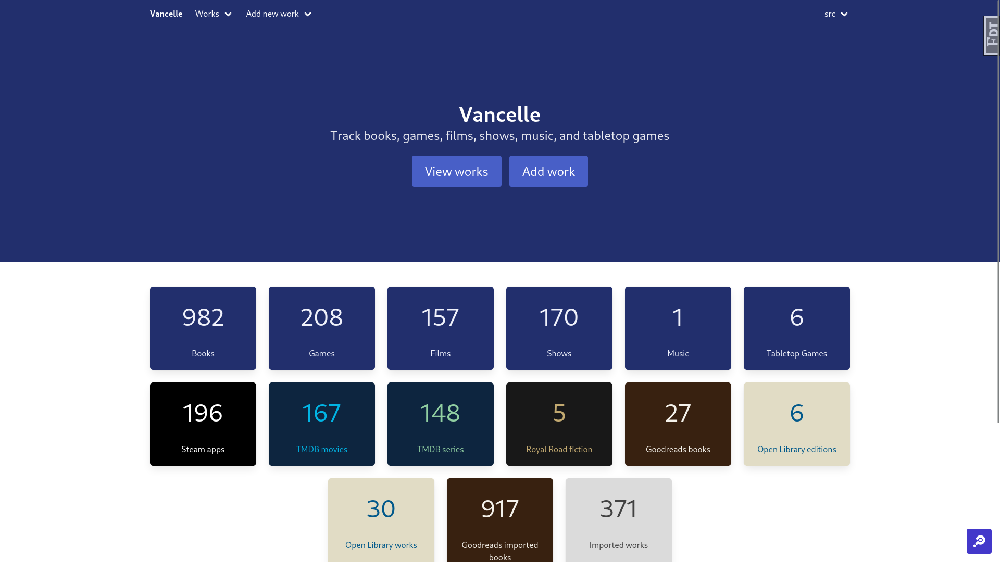
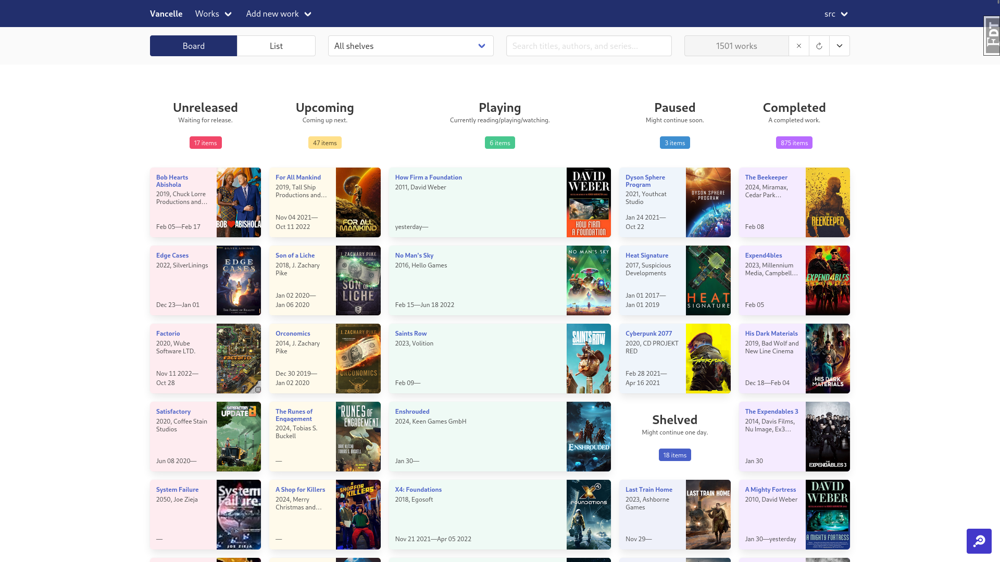
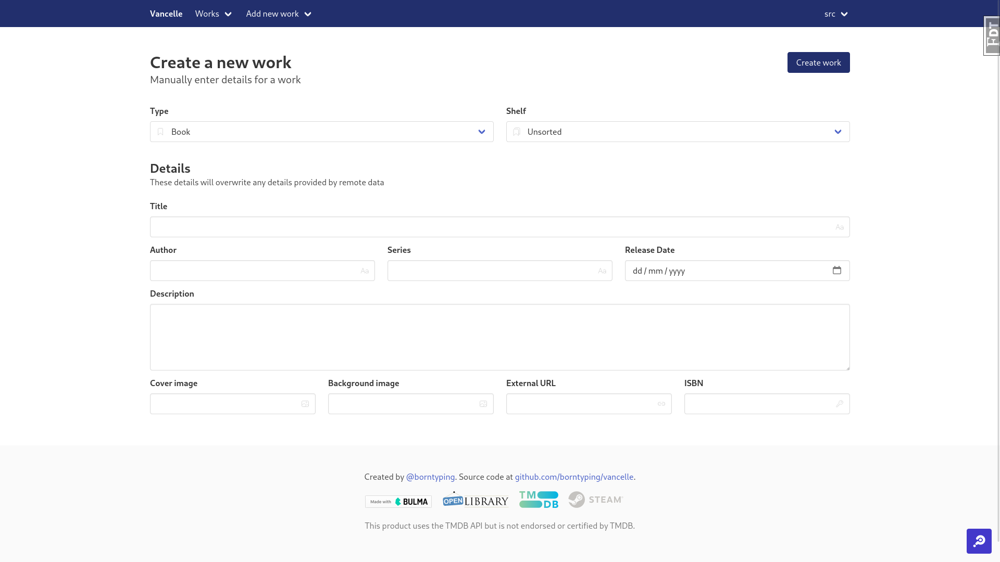
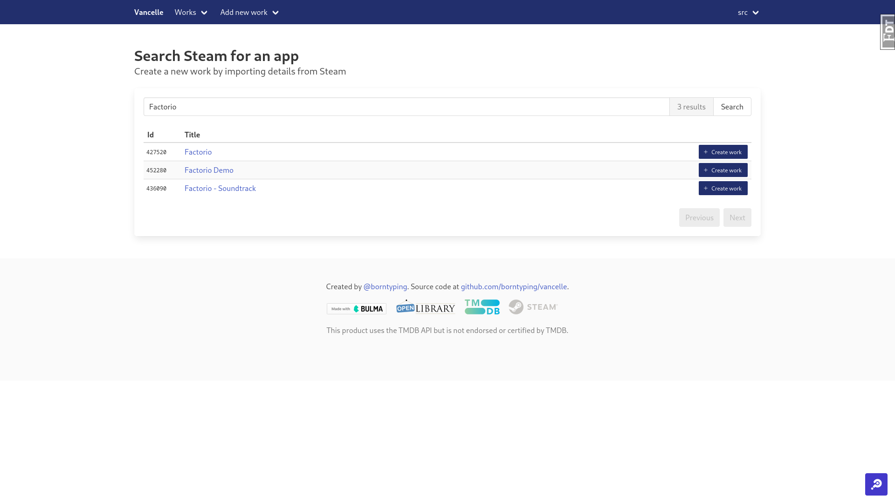

# vancelle

Vancelle is my personal webapp for tracking media I'm interested in.

It's a manually managed database of books, games, films, shows, music, and
games. "Shelves" are used to group media by status, like "upcoming", "now
playing", and "completed". Cover images and other details can be imported from
external sources like OpenLibrary or TMDB. 

It's partially a replacement for Goodreads, which doesn't (currently) have a
public API and doesn't include all reading dates in it's exported data. It's
partially a way for me to escape the mass of different trackers, lists, and
storefronts; and instead have one place to track everything I'm interested in
both before and after reading/watching/playing it.

|                                    |                                    |
|------------------------------------|------------------------------------|
|    |   |
|  |  |
|                                    |                                    |

## Attributions

* Frontend: [Bulma](https://bulma.io/), [HTMX](https://htmx.org/), [Hyperscript](https://hyperscript.org/).
  * Icons from [Ionicons](https://ionic.io/ionicons/).
  * Favicons created with [realfavicongenerator.net](https://realfavicongenerator.net/svg-favicon/).
  * `manifest.json` based on [Web app manifests | MDN](https://developer.mozilla.org/en-US/docs/Web/Manifest).
* Backend: [Flask](https://flask.palletsprojects.com/), [PostgreSQL](https://www.postgresql.org/), [Python](https://www.python.org/).

## Copyright

Mozilla Public License Version 2.0. See the [LICENSE](./LICENSE) file.
